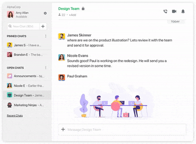

# ChatOverflow

Chat Overflow is like a go-to place for devs like you to get answers when you need 'em, without having to waste time waiting for an answer on a post.

Our main deal is the public Q&A thing that tons of folks, like over 100 million, visit every month to ask questions, learn, and share techie know-how.

We've got tools and things that help people find what they need to build stuff, whether they're doing it for work or just messing around at home.

# To run this project on your machine:

1- Download this repo

2- Open it on VS Code

3- Open 2 Terminals

4- In one terminal cd to server folder

5- In the second terminal cd to frontend folder

6- To start, you can run both with the same command: " npm run dev "

# Screenshots

# Check out the presentation video: 

[Watch Video](https://youtu.be/Z-6kq6ONtjc?si=dcUNVpDZeYEPwt_b)

# Phases

Phase 1 has been released and next phase would be implementing the chat and forum features.

